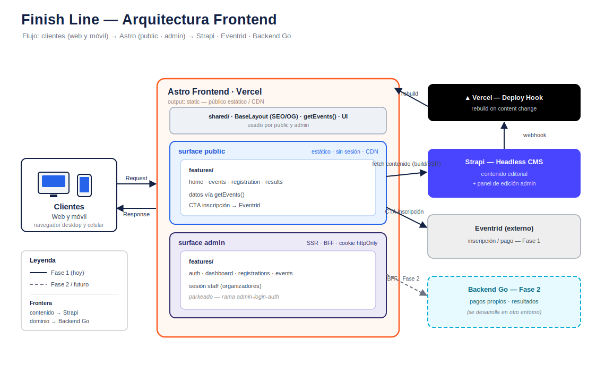

# Finish Line — Frontend

Frontend en **Astro** de Finish Line: plataforma de **inscripción a eventos
deportivos** (running) en Bolivia. Sitio público en producción:
[www.finishlinebolivia.com](https://www.finishlinebolivia.com).

> **Este repo es solo frontend.** El backend (Go) y la base de datos se
> desarrollan en otro entorno. Acá vive la capa de presentación y su BFF.

## 🎯 Qué resuelve hoy

Esta entrega es la **landing pública** que promociona el **próximo evento**
(La Paz 10K) y empuja a la única acción que importa: **inscribirse**. En la Fase 1
la inscripción **no es nativa**: el CTA redirige a **Eventrid** (plataforma
externa de registro). El público objetivo llega mayormente **desde el celular**.

Producto y principios de marca en **[PRODUCT.md](PRODUCT.md)**; diseño en
**[DESIGN.md](DESIGN.md)**.

## 🏗️ Arquitectura



Front **Astro-first**, dividido en dos **superficies** por audiencia, con
fronteras duras de auth, rendering e identidad visual:

| Superficie   | Audiencia               | Auth            | Rendering               |
| ------------ | ----------------------- | --------------- | ----------------------- |
| **`public`** | corredores / visitantes | sin sesión      | estático / CDN          |
| **`admin`**  | organizadores / staff   | sesión + cookie | SSR (`prerender=false`) |

**Frontera de datos (decisión clave):**

- **Contenido** (descripción de eventos, copy, recorrido, galería) → **headless
  CMS (Strapi)**, que además aporta el panel de edición para el staff.
- **Dominio transaccional** (pagos propios, resultados) → **backend Go** aparte.
  No duplica contenido: referencia el evento del CMS por id/slug.
- **Eventrid** es el puente de inscripción de la **Fase 1**; en la **Fase 2** la
  inscripción, los pagos y los resultados pasan a ser **nativos** (Go).

El front no se acopla a la fuente de datos: las superficies consumen contenido a
través de una capa (`getEvents()`) que hoy puede leer Content Collections locales
y mañana hace `fetch` a Strapi sin tocar componentes.

Detalle completo (reglas por superficie, capa server-only, alias de import) en
**[ARCHITECTURE.md](ARCHITECTURE.md)**.

> El diagrama es editable: abrí
> **[architecture-frontend.drawio](architecture-frontend.drawio)** con la
> extensión Draw.io y, tras editar, regenerá el `.svg` que se muestra arriba.

## 🧱 Stack

- **[Astro 6](https://astro.build)** — `output: static`; `admin` opta a SSR vía
  `prerender = false`.
- **[Tailwind CSS v4](https://tailwindcss.com)** (plugin de Vite).
- **[Vercel](https://vercel.com)** — hosting + adapter + Web Analytics.
- **pnpm** · **Node ≥ 22.12**.
- `@astrojs/sitemap`, `sharp` (imágenes), favicons generados (`scripts/`).

## 📂 Estructura

```text
src/
├── pages/                  # SOLO routing (páginas delgadas)
├── surfaces/
│   ├── public/             # audiencia pública (estática)
│   │   ├── layouts/  features/  components/
│   │   └── ...
│   └── admin/              # audiencia staff (SSR · BFF · cookie)
├── content/                # Content Collections (eventos, tipados con Zod)
├── shared/                 # cross-surface: layouts, ui, lib/server, styles
└── assets/                 # imágenes/SVG procesados por Astro
```

Alias de import: `@shared/*`, `@public/*`, `@admin/*`. Más en
**[ARCHITECTURE.md](ARCHITECTURE.md)**.

## 🧞 Comandos

Desde la raíz del proyecto:

| Comando          | Acción                                            |
| :--------------- | :------------------------------------------------ |
| `pnpm install`   | Instala dependencias                              |
| `pnpm dev`       | Servidor local en `localhost:4321`                |
| `pnpm build`     | Compila el sitio a `./dist/`                      |
| `pnpm preview`   | Previsualiza el build antes de desplegar          |
| `pnpm astro ...` | CLI de Astro (`astro add`, `astro check`, etc.)   |

## 🔀 Flujo de trabajo

Entornos `develop` (**staging**) → `main` (**producción**, rama por defecto y
**protegida**). Cada cambio entra por una **rama feature** y se integra vía PR a
`develop`; la promoción a producción es un PR `develop → main`.

Antes de tocar ramas o abrir un PR, leé **[CONTRIBUTING.md](CONTRIBUTING.md)**.

## 🔐 Variables de entorno

Declaradas en `astro.config.mjs` (`astro:env`). Copiá `.env.example` a `.env`:

| Variable         | Contexto | Descripción                                      |
| ---------------- | -------- | ------------------------------------------------ |
| `BACKEND_URL`    | server   | URL base del backend Go (solo BFF server-side)   |
| `SESSION_SECRET` | server   | Secreto para firmar la cookie de sesión admin    |

Solo se importan desde código server-side (`astro:env/server`). Ver la frontera
server-only en **[ARCHITECTURE.md](ARCHITECTURE.md)**.

## 🔎 SEO

Baseline incluido: `sitemap`, `robots`, JSON-LD `SportsEvent`, Open Graph
(1200×630), título con año y favicons de marca (`scripts/gen-favicons.mjs`).

## 📚 Documentación

| Documento                            | Contenido                                  |
| ------------------------------------ | ------------------------------------------ |
| **[ARCHITECTURE.md](ARCHITECTURE.md)** | Superficies, rendering, frontera server-only, alias |
| **[PRODUCT.md](PRODUCT.md)**         | Producto, usuarios, marca y principios     |
| **[DESIGN.md](DESIGN.md)**           | Lineamientos de diseño                     |
| **[CONTRIBUTING.md](CONTRIBUTING.md)** | Entornos, ramas y flujo diario            |
